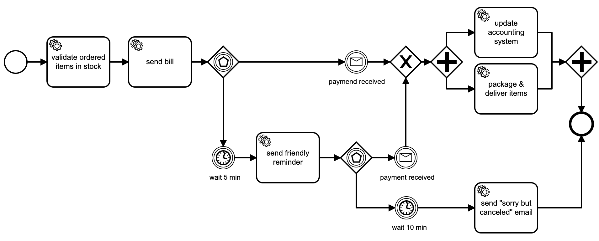

### A microservice, showcasing a fictionary shopping use case 

The following example snippet shows how a microservice could use BPMN engine
to process orders and provides status feedback to clients.

For this example, we leverage messages and timers, to orchestrate some tasks.


For this microservice, we first define some simple API.
<!-- MARKDOWN-AUTO-DOCS:START (CODE:src=./examples/ordering_microservice/ordering_microservice_routes.go) -->
<!-- The below code snippet is automatically added from ./examples/ordering_microservice/ordering_microservice_routes.go -->
```go
package main

import "net/http"

func initHttpRoutes() {
	http.HandleFunc("/api/order", handleOrder)                                        // POST new or GET existing Order
	http.HandleFunc("/api/receive-payment", handleReceivePayment)                     // webhook for the payment system
	http.HandleFunc("/show-process.html", handleShowProcess)                          // shows the BPMN diagram
	http.HandleFunc("/index.html", handleIndex)                                       // the index page
	http.HandleFunc("/", handleIndex)                                                 // the index page
	http.HandleFunc("/ordering-items-workflow.bpmn", handleOrderingItemsWorkflowBpmn) // the BPMN file, for documentation purpose
}
```
<!-- MARKDOWN-AUTO-DOCS:END -->

Then we initialize the BPMN engine and register a trivial handler, which just prints on STDOUT.
<!-- MARKDOWN-AUTO-DOCS:START (CODE:src=./examples/ordering_microservice/ordering_microservice_bpmn.go) -->
<!-- The below code snippet is automatically added from ./examples/ordering_microservice/ordering_microservice_bpmn.go -->
```go
package main

import (
	"fmt"
	"time"

	"github.com/nitram509/lib-bpmn-engine/pkg/bpmn_engine"
)

func initBpmnEngine() {
	bpmnEngine = bpmn_engine.New()
	process, _ = bpmnEngine.LoadFromBytes(OrderingItemsWorkflowBpmn)
	bpmnEngine.NewTaskHandler().Id("validate-order").Handler(printHandler)
	bpmnEngine.NewTaskHandler().Id("send-bill").Handler(printHandler)
	bpmnEngine.NewTaskHandler().Id("send-friendly-reminder").Handler(printHandler)
	bpmnEngine.NewTaskHandler().Id("update-accounting").Handler(updateAccountingHandler)
	bpmnEngine.NewTaskHandler().Id("package-and-deliver").Handler(printHandler)
	bpmnEngine.NewTaskHandler().Id("send-cancellation").Handler(printHandler)
}

func printHandler(job bpmn_engine.ActivatedJob) {
	// do important stuff here
	println(fmt.Sprintf("%s >>> Executing job '%s'", time.Now(), job.ElementId()))
	job.Complete()
}

func updateAccountingHandler(job bpmn_engine.ActivatedJob) {
	println(fmt.Sprintf("%s >>> Executing job '%s'", time.Now(), job.ElementId()))
	println(fmt.Sprintf("%s >>> update ledger revenue account with amount=%s", time.Now(), job.Variable("amount")))
	job.Complete()
}
```
<!-- MARKDOWN-AUTO-DOCS:END -->

Since the ```/api/order``` endpoint can be requested with the GET or POST method,
we need to make the handler smart enough to either create an order process instance or respond a status
<!-- MARKDOWN-AUTO-DOCS:START (CODE:src=./examples/ordering_microservice/ordering_microservice_order.go) -->
<!-- The below code snippet is automatically added from ./examples/ordering_microservice/ordering_microservice_order.go -->
```go
package main

import (
	_ "embed"
	"fmt"
	"net/http"
	"strconv"
)

func handleOrder(writer http.ResponseWriter, request *http.Request) {
	if request.Method == "POST" {
		createNewOrder(writer, request)
	} else if request.Method == "GET" {
		showOrderStatus(writer, request)
	}
}

func createNewOrder(writer http.ResponseWriter, request *http.Request) {
	instance, _ := bpmnEngine.CreateAndRunInstance(process.ProcessKey, nil)
	redirectUrl := fmt.Sprintf("/show-process.html?orderId=%d", instance.GetInstanceKey())
	http.Redirect(writer, request, redirectUrl, http.StatusFound)
}

func showOrderStatus(writer http.ResponseWriter, request *http.Request) {
	orderIdStr := request.URL.Query()["orderId"][0]
	orderId, _ := strconv.ParseInt(orderIdStr, 10, 64)
	instance := bpmnEngine.FindProcessInstance(orderId)
	if instance != nil {
		// we re-use this GET request to ensure we catch up the timers - ideally the service uses internal timers instead
		bpmnEngine.RunOrContinueInstance(instance.GetInstanceKey())
		bytes, _ := prepareJsonResponse(orderIdStr, instance.GetState(), instance.GetCreatedAt())
		writer.Header().Set("Content-Type", "application/json")
		writer.Write(bytes)
		return
	}
	http.NotFound(writer, request)
}
```
<!-- MARKDOWN-AUTO-DOCS:END -->

Also, for the incoming payments, our microservice provides an endpoint so that we get informed
by external payment service. This handler sends a message to the process instance and continues.
<!-- MARKDOWN-AUTO-DOCS:START (CODE:src=./examples/ordering_microservice/ordering_microservice_payments.go) -->
<!-- The below code snippet is automatically added from ./examples/ordering_microservice/ordering_microservice_payments.go -->
```go
package main

import (
	_ "embed"
	"net/http"
	"strconv"
)

func handleReceivePayment(writer http.ResponseWriter, request *http.Request) {
	orderIdStr := request.FormValue("orderId")
	amount := request.FormValue("amount")
	if len(orderIdStr) > 0 && len(amount) > 0 {
		orderId, _ := strconv.ParseInt(orderIdStr, 10, 64)
		processInstance := bpmnEngine.FindProcessInstance(orderId)
		if processInstance != nil {
			vars := map[string]interface{}{
				"amount": amount,
			}
			bpmnEngine.PublishEventForInstance(processInstance.GetInstanceKey(), "payment-received", vars)
			bpmnEngine.RunOrContinueInstance(processInstance.GetInstanceKey())
			http.Redirect(writer, request, "/", http.StatusFound)
			return
		}
	}
	writer.WriteHeader(400)
	writer.Write([]byte("Bad request: the request must contain form data with 'orderId' and 'amount', and the order must exist"))
}
```
<!-- MARKDOWN-AUTO-DOCS:END -->

To get the snippet compile, see the other sources in the
[examples/ordering_microservice/](./examples/ordering_microservice/) folder.
