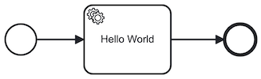
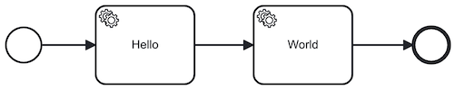

## Multiple BPMN process versions

The lib-bpmn-engine supports working with multiple version of a BPMN process.
Typically, you want to do this, when you have long-running processes instances in-flight,
and you want to e.g. bug-fix or improve a BPMN process.
In such a scenario, you can't alter in-flight instances, but in parallel loading a newer v2 version,
and create new instances from this v2 process.
You could then decide to cancel older v1 process instances or simply wait for them to complete.

### Hello World example with v1 and v2

Consider you have two hello world processes ...

**v1** \


**v2** \


Both definitions have the same ID=`hello-world-process-id`.
The engine will load both and assign `version=2` to the second process.
Creating new instances is then possible by either knowing the process key (which is returned when loading the BPMN),
or by knowing the ID. The example below uses the latter.

Hint: the handler will be called twice, since in v2, both service task have the same type.

<!-- MARKDOWN-AUTO-DOCS:START (CODE:src=./examples/multiple_versions/multiple_versions.go) -->
<!-- The below code snippet is automatically added from ./examples/multiple_versions/multiple_versions.go -->
```go
package main

import (
	"github.com/nitram509/lib-bpmn-engine/pkg/bpmn_engine"
)

func main() {
	// create a new named engine
	bpmnEngine := bpmn_engine.New()
	// basic example loading a v1 BPMN from file,
	_, err := bpmnEngine.LoadFromFile("simple_task.bpmn")
	if err != nil {
		panic("file \"simple_task.bpmn\" can't be read. " + err.Error())
	}
	// now loading v2, basically with the same process ID
	_, err = bpmnEngine.LoadFromFile("simple_task_v2.bpmn")
	if err != nil {
		panic("file \"simple_task.bpmn\" can't be read. " + err.Error())
	}

	// register a handler for a service task by defined task type
	bpmnEngine.NewTaskHandler().Type("hello-world").Handler(printElementIdHandler)
	// and execute the process, means we will use v2
	bpmnEngine.CreateAndRunInstanceById("hello-world-process-id", nil)
}

func printElementIdHandler(job bpmn_engine.ActivatedJob) {
	println(job.ElementId())
	job.Complete() // don't forget this one, or job.Fail("foobar")
}
```
<!-- MARKDOWN-AUTO-DOCS:END -->

To get the snippet compile, see the full sources in the
[examples/timers/](./examples/multiple_versions/) folder.
