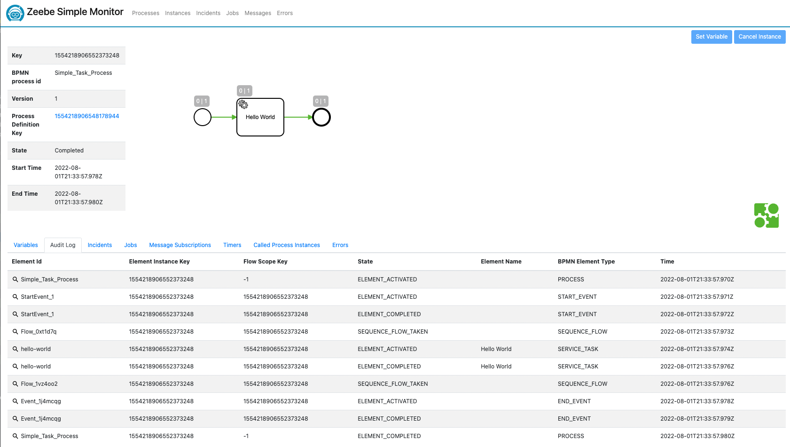
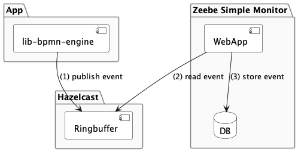

## Visualize process state via Zeebe Simple Monitor

### Overview

Since lib-bpmn-engine runs embedded in your application,
it's a challenge, to "see what's happen inside". Therefore, this library exports 
all internal events and you can register various event exporters.
That might be a simple STDOUT exporter, or one that exports to a dedicated visualisation application.

There's an Open Source Web UI for monitoring BPMN processes [Zeebe Simple Monitor](https://github.com/camunda-community-hub/zeebe-simple-monitor).
Fortunately, the authors did design the monitor as an event consumer.
Thus, by exporting Zeebe compatible events, you're able to monitor your processes.

#### Screenshot



#### Architecture

As shown in the architecture diagram, your App and Zeebe Simple Montor don't
connect to each other, but rather your app needs to connect to a [Hazelcast Ringbuffer](https://docs.hazelcast.com/imdg/4.2/data-structures/ringbuffer).
Once connected, the built-in Zeebe Exporter will export events to this Ringbuffer.
The Zeebe Simple Monitor (ZSM) is a Java based application, which connects to the Ringbuffer
as well and fetches events from there. Once fetched, ZSM stores events in it's own database.
The ZSM database can be configured to your preferences.

Please, keep in mind, this architecture does not support any namespacing.
Means, when multiple of your applications connect to the same Ringbuffer,
all events will be mixed up. That's less an issue technically, but might confuse your users.



#### Limitations

As with the first and experimental release, just a handful of events are supported.
This means, in contract to a full flavoured Zeebe cluster, events are missing
and will not be shown. That said, basic functionality in Simple Monitor is given.

Once you application restarts, workflows are newly deployed and so they are shown
multiple times in Zeebe Simple Monitor (ZSM). This is because of the design/architecture
of lib-bpmn-engine. With a new start of your app, a new ID will be assigned
and ZSM ha no chance to detect former workflows/processes are identical.

Housekeeping is missing in ZSM, which results in events just stack up and will slow down your database.

The ringbuffer support in Hazelcast's Go client is not yet officially merged.
So, lib-bpmn-engine uses a feature branch of the client to write to the ringbuffer.

### Setup for tinkering/experimenting

Here are some hints, how you can quickly spin up a setup for experimenting.
If you aim for a more production ready setup, please read&learn how to do such
with Hazelcast and Zeebe Simple Monitor on their official web sites individually.

#### Hazelcast

First, you need a running Hazelcast. The simplest way is using Docker...
```shell
docker run -p 5701:5701  hazelcast/hazelcast:latest
```

#### Zeebe Simple Monitor

Using Docker, also allows you to start a Zeebe Simple Monitor...
```shell
docker run -p 8082:8082 -e "zeebe.client.worker.hazelcast.connection=$(hostname):5701" ghcr.io/camunda-community-hub/zeebe-simple-monitor:2.4.0```
```

⚠️ The above Docker containers do expose each service without any authentication!
This mean, anyone in your network can connect to it - please, use a proper firewall
or other tools to secure your system.

#### Zeebe Exporter Showcase App

<!-- MARKDOWN-AUTO-DOCS:START (CODE:src=./examples/zeebe_exporter/zeebe_exporter.go) -->
<!-- The below code snippet is automatically added from ./examples/zeebe_exporter/zeebe_exporter.go -->
```go
package main

import (
	"context"
	"fmt"
	"github.com/hazelcast/hazelcast-go-client"
	"github.com/nitram509/lib-bpmn-engine/pkg/bpmn_engine"
	"github.com/nitram509/lib-bpmn-engine/pkg/bpmn_engine/exporter/zeebe"
)

func main() {
	// create a new named engine
	bpmnEngine := bpmn_engine.New()
	// the exporter will require a running Hazelcast cluster at 127.0.0.1:5701
	ctx := context.TODO()
	config := hazelcast.Config{}
	config.Cluster.Network.SetAddresses("localhost:5701")
	client, err := hazelcast.StartNewClientWithConfig(ctx, config)
	// create the client
	exporter, _ := zeebe.NewExporterWithHazelcastClient(client)
	// register the exporter
	bpmnEngine.AddEventExporter(&exporter)
	// basic example loading a BPMN from file,
	process, err := bpmnEngine.LoadFromFile("simple_task.bpmn")
	if err != nil {
		panic("file \"simple_task.bpmn\" can't be read.")
	}
	// register a handler for a service task by defined task type
	bpmnEngine.NewTaskHandler().Id("hello-world").Handler(printContextHandler)
	// and execute the process
	instance, _ := bpmnEngine.CreateAndRunInstance(process.ProcessKey, nil)

	println(fmt.Sprintf("instanceKey=%d", instance.GetInstanceKey()))
}

func printContextHandler(job bpmn_engine.ActivatedJob) {
	// trivial handler is requires
	job.Complete()
}
```
<!-- MARKDOWN-AUTO-DOCS:END -->
