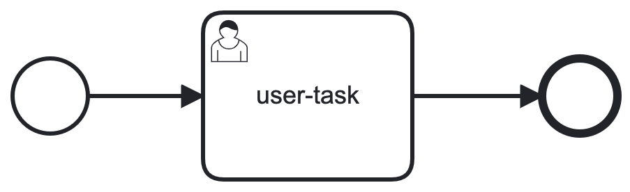

## Task Handlers

### Declaration & Definition

You can declare service tasks and users tasks in BPMN.
Both declarations have in common, that you must specify a unique ID per task element.
Per each ID, you can add/define a single task handler, when using the engine.

For some use cases you might want to add/define a single task handler for multiple tasks.
This is, where the task 'type' comes into play. This library is compatible with Zeebe's
'taskDefinition' extension, which allows you to declare a single 'type' for many tasks in the BPMN,
and thus you're able to use just a single handle for this type.
For user tasks you can define an 'assignee' or multiple 'candidate groups' as in Zeebe.

In case multiple handlers are defined and would potentially match the declaration,
the specific ones have precedence over the generic ones. Also, first defined one wins.
For service tasks this means, the handler with ID matching is called instead of the handler with TYPE matching.
And for user tasks this means, the handler with ID matching is called instead of the handler with assignee matching
instead of the handler with a candidate group matching.

ℹ️ In contrast to Zeebe, the declarations for 'type', 'assignee', and 'candidateGroups'
are not evaluated but just treated as static string constants in lib-bpmn-engine.

### Service Tasks vs. User Tasks

The engine (as of now) handles service tasks and user tasks almost equal.
There are some differences you should consider, when implementing your handler(s).

* add/register handlers for 'id' os possible for all tasks
* add/register a handler for 'type' is only possible for service tasks
* add/register a handler for 'assignee' or 'candidate groups' is only possible for user tasks
* tasks can be paused
    * a task handler must always call `.Complete()` or `.Fail()`, when work is completed
    * a task handler might just return (without calling `.Complete()` or `.Fail()`), and being resumed later in time (see below)

##### Synchronous vs. Asynchronous

By default, the lib-bpmn-engine expects a task handler to complete a task, by calling the `.Complete()` or `.Fail()` function.
So, when you're implementing with this library, your task handlers would be called synchronously.
But, when task handlers do e.g. check external DB for a parcel delivery in a certain state, and then simply return,
without signaling complete or fail, then you can implement asynchronous behaviour.
This also mean, you need to call `.RunOrContinueInstance()` until your process instance reaches the `Completed` state.
See also the example in section [Pause and resume tasks](#pause-and-resume-tasks)

### Pause and resume Tasks

Hint: this section is more tailored for user tasks, but works likewise for service tasks.

Processing a simple user task typically involves external action by a human.
The lib-bpmn-engine will therefore pause a process instance, when such a task is reached.

{: .half-width }

The example code mimics the external action via the `externalEvent` variable.
Typically, you will create and run an instance, then notify a human and once the human
responses with some event, you will continue the process.
The `.Complete()` and `.Fail()` methods let you handle errors.

<!-- MARKDOWN-AUTO-DOCS:START (CODE:src=./examples/pause_user_tasks/pause_user_tasks.go) -->
<!-- The below code snippet is automatically added from ./examples/pause_user_tasks/pause_user_tasks.go -->
```go
package main

import (
	"github.com/nitram509/lib-bpmn-engine/pkg/bpmn_engine"
)

func main() {
	bpmnEngine := bpmn_engine.New()
	process, _ := bpmnEngine.LoadFromFile("simple-user-task.bpmn")
	bpmnEngine.NewTaskHandler().Assignee("assignee").Handler(userTaskHandler())
	instance, _ := bpmnEngine.CreateAndRunInstance(process.ProcessKey, nil)
	// ... just wait for the human completed his/her task
	bpmnEngine.RunOrContinueInstance(instance.GetInstanceKey())
}

var externalEvent = "none"

func userTaskHandler() func(job bpmn_engine.ActivatedJob) {
	return func(job bpmn_engine.ActivatedJob) {
		if externalEvent == "none" {
			// send notification to user
		}
		if externalEvent == "user is done" {
			job.Complete()
		}
		if externalEvent == "user is done but wrong response" {
			job.Fail("error in user task")
		}
		// just return and so 'pause' the process instance
	}
}
```
<!-- MARKDOWN-AUTO-DOCS:END -->
