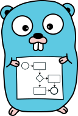

# lib-bpmn-engine

## Motivation

A BPMN engine, meant to be embedded in Go applications with minimum hurdles,
and a pleasant developer experience using it.
This approach can increase transparency of code/implementation for non-developers.

This library is meant to be embedded in your application and should not introduce more runtime-dependencies.
Hence, there's no database support built nor planned.
Also, the engine is not agnostic to any high availability approaches, like multiple instances or similar.

See [Getting Started](./getting-started.md)

There's an experimental **online playground** https://nitram509.github.io/lib-bpmn-engine-js/ available,
which leverages the great power of cross-compiling to WASM.

## Philosophies around BPMN

The BPMN specification in its core is a set of graphical symbols (rectangles, arrows, etc.)
and a standard definition about how to read/interpret them.
With this foundation, it's an excellent opportunity to enrich transparency or communication or discussions
about implementation details. So BPMN has a great potential to support me as a developer to not write
documentation into a wiki but rather expose the business process via well known symbols/graphics.

There's a conceptual similarity in usage between BPMN and OpenAPI/Swagger.
As developers, on the one hand side we often use OpenAPI/Swagger to document our endpoints, HTTP methods, and purpose
of the (HTTP) interface, our services offer. Hence, we enable others to use and integrate them.
With BPMN on the other hand it can be conceptual similar, when it comes to share internal behaviour of our services.
I see even larger similarity, when it comes to the question: *How do I maintain the documentation?*
Again, on the one hand side with OpenAPI/Swagger, we tend to either use reflection and code generators
or we follow the API spec first approach.
The later one is addressed by this library in the BPMN context: **Business Process spec first approach**

### goals and development guidelines (for the engine)

The lib-bpmn-engine library follows these architectural goals/guidelines

* being graceful in reading BPMN files
* support multiple (named) instances of the engine within the same process
* support BPMN elements, as guided/requested by the community (means incremental feature development)
* not being standard compliant (as in tolerating some errors)
* no linting/validation of BPMN
* no database support (just (de-)marshalling is planned)
* no locking/synchronization support (should be implemented by the application itself)
* no built-in user interface (but export of events, so UI could be use or built)
* no built-in scheduler/timer (but can be provided)
* no support for BPMN compensation spec (which I consider bad practice, for the same reason, why roll-back is more complicated than roll-forward-with-fix)

## Main Features

* in-memory BPMN engine, to be embedded in other Go applications
* able to execute BPMN 2.0 xml workflow models
* no database support by design - there's just marshalling/unmarshalling support planned
* generic event export interface to make internal processing transparent
* basic BPMN element supported, see [Supported Elements](./supported-elements.md)
* support dynamic decision via [expression language](./expression-syntax.md) support

The following experimental features have known limitations, and rather showcase some capabilities.
Experimental features might even be removed in the future!

* EXPERIMENTAL: event exporter for [Zeebe Simple Process Monitor](./advanced-zeebe.md) 

