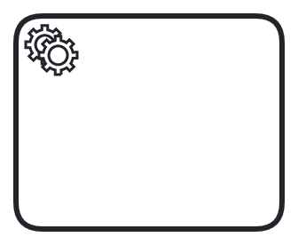
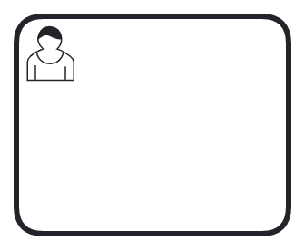

These BPMN elements are supported by the latest release of lib-bpmn-engine.
There are some comments as well, which describe the level of support per each element.

## Start Event                      

{: .width-60pt }                      

* multiple start events are supported and are triggered in order of appearance. 

## End Event                        
{: .width-60pt }  

* multiple end events are supported as well.

## Service Task                     
{: .width-60pt }         

* you can define task handlers for one or multiple tasks (by ID or by Type)
* get & set variables from/to context (of the instance) is possible
* variable mapping is supported (for input and output, see [Variables](#variables))

## User Task                        
{: .width-60pt }      

* you can define task handlers for one or multiple tasks (by assignee or by candidate groups)
* equally handled like service tasks
* get & set variables from/to context (of the instance) is possible
* variable mapping is supported (for input and output, see [Variables](#variables))

## Gateways

The Parallel Gateway and the Exclusive Gateway do allow fork and join logic,
as well as parallel execution. The library does not support real parallel execution,
but flows are processed in order of appearance in the BPMN file.

* Forks
    * controlled and uncontrolled forks are supported
    * parallel gateway supported
    * exclusive gateway with conditions supported
* Joins
    * uncontrolled and exclusive joins are supported
    * parallel joins are supported

### Exclusive Gateway                
{: .width-60pt }                

* fully supported, incl. conditional expressions per each outgoing flow

### Parallel Gateway                 
{: .width-60pt }        

* fully supported, incl. conditional expressions per each outgoing flow

### Event Based Gateway              
{: .width-60pt }              

* fully supported

## Message Intermediate Catch Event 
{: .width-60pt } 

* at the moment, just matching/correlation by name supported
* variable mapping is supported (for output, see [Variables](#variables))

## Timer Intermediate Catch Event   
{: .width-60pt }     

* supported
* a ticker/scheduler needs to be externally provided, see [Timers](advanced-timers.md)

## Link Intermediate Throw & Catch Event

* supported
* variable mapping is supported(for output, see [Variables](#variables))

{: .width-60pt }     
{: .width-60pt }         
----

## Variables

### Input Variables

Input mappings can be used to create new variables. They can be defined on service tasks and user task.
When an input mapping is applied, it creates a new local variable in the scope (visible in the task handler)
where the mapping is defined.

### Output Variables

Output mappings can be used to customize how job/message variables are merged into the process instance.
They can be defined on service tasks, user tasks, and message catch events.

Within a task handler, variables are set as local variables (local scope).
When the handler completes the job, the output mappings are applied to the variables
and create new variables in this scope. The new variables are merged into the parent scope (typically the process instance).
If there is no mapping for a job/message variable, the variable is not merged.
In other words: if one or more variables are defined, only these are mapped.

If no output mappings are defined, all job/message variables are merged into the process instance.
